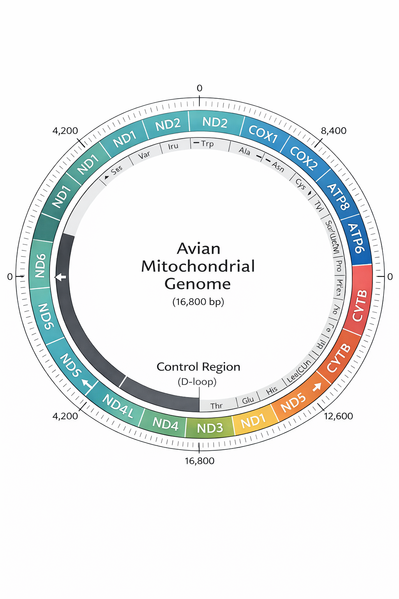

# mtDNA-mitofinder-pipeline
# 🧬 Avian mtDNA Mitofinder Pipeline

A SLURM-parallelized mitochondrial genome pipeline for birds integrating:

- Read mapping (BWA MEM)
- Variant calling (haploid; bcftools)
- Consensus sequence generation
- CDS extraction from GenBank annotations
- De novo mitochondrial assembly & annotation (MitoFinder)

Designed for HPC environments.

---

## 🧬 Avian Mitochondrial Genome Ideogram

  

Typical avian mitochondrial genome (~16.8 kb):

- 13 protein-coding genes  
- 22 tRNAs  
- 2 rRNAs  
- Control Region (D-loop)  
- ND6 encoded on the light strand  

---

## 🔬 Pipeline Workflow

### Main analytical branch (per sample)
