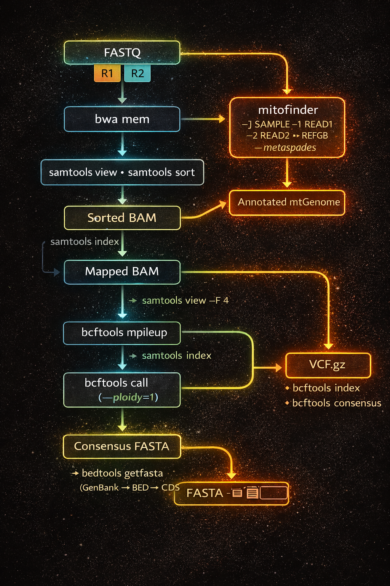

#  Avian mtDNA Mitofinder Pipeline

A SLURM-parallelized mitochondrial genome analysis pipeline for birds integrating:

- Read mapping (BWA MEM)
- Variant calling in haploid mode (BCFtools)
- Consensus sequence generation
- CDS extraction from GenBank annotations
- De novo mitochondrial assembly and annotation using MitoFinder

Designed for reproducible execution on HPC systems.

---

## Avian Mitochondrial Genome Ideogram

<p align="center">
  
</p>

Typical avian mitochondrial genome (~16.8 kb):

- 13 protein-coding genes  
- 22 tRNAs  
- 2 rRNAs  
- Control Region (D-loop)  
- ND6 encoded on the light strand  

---

##  Pipeline Workflow

<p align="center">
  
</p>

---

## Inputs

### 1) `sample_list.txt` (must be in repo root)
Each line: `SAMPLE_ID  READ1.fastq.gz  READ2.fastq.gz`

### 2) Reference files (must be in `reference/`)
- `reference/NC_041257.fa` (FASTA reference for mapping + consensus)
- `reference/NC_041257.gb` (GenBank file used to parse CDS coordinates + guide MitoFinder)

---

## ⚙️ Installation (Conda)

Create environment:

```bash
conda env create -f env/environment.yml
conda activate mt_pipeline

**## Running the Pipeline**
sbatch scripts/mt_pipeline.slurm.sh

### Main analysis branch (per sample)
